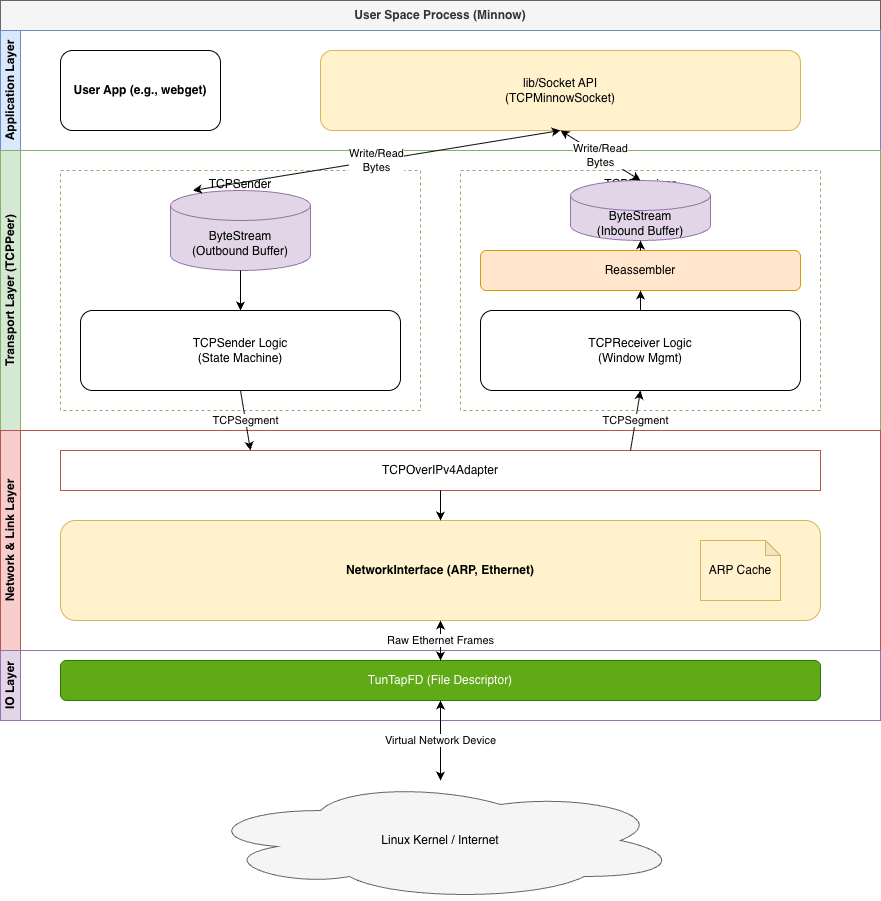
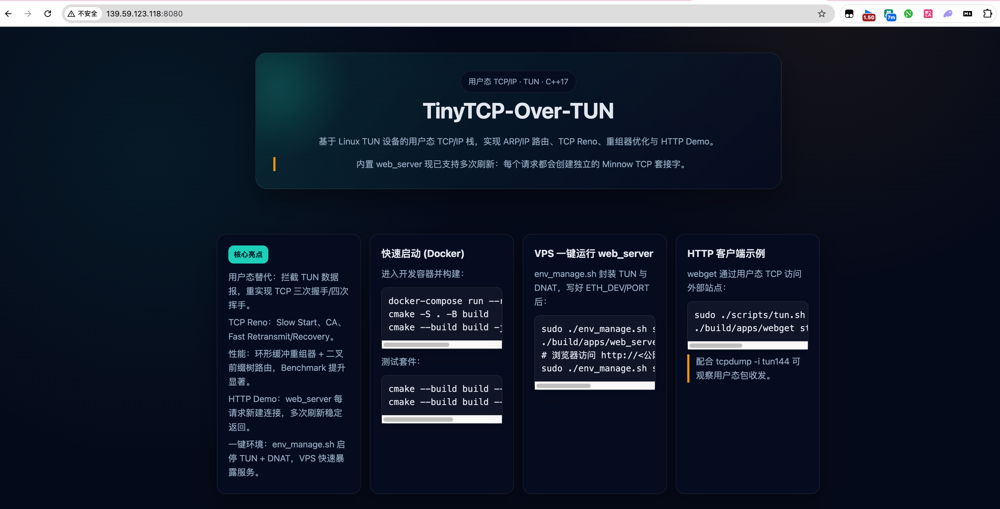
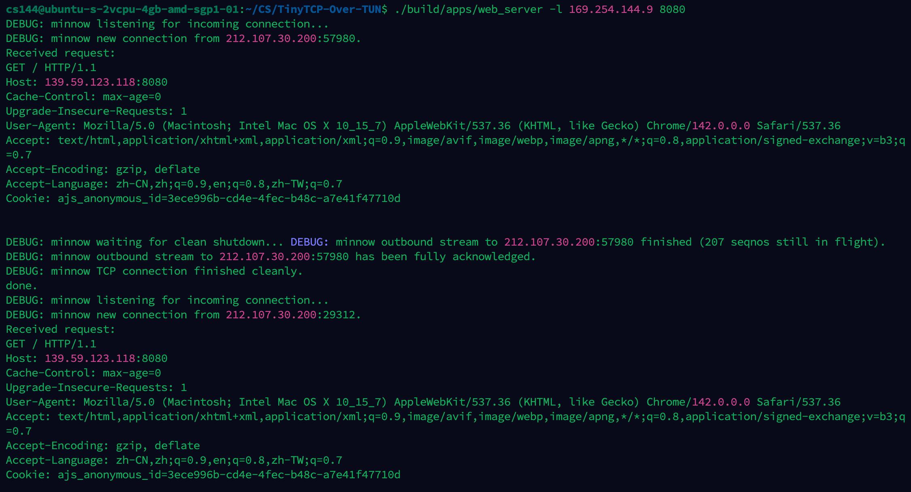
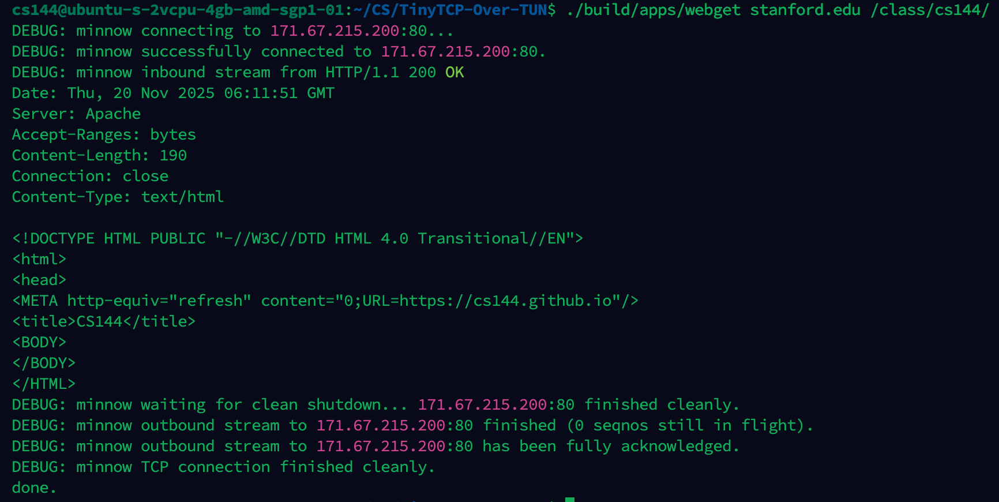
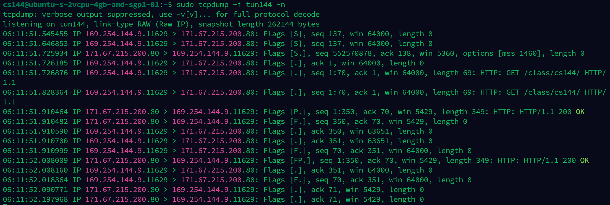

[English Version](README_EN.md)
# TinyTCP-Over-TUN: 用户态 TCP/IP 协议栈

  

TinyTCP-Over-TUN 是一个基于 **C++17** 构建的**用户态 TCP/IP 协议栈**。

本项目通过 `Linux TUN/TAP` 设备**接管操作系统网络流量**，绕过内核 TCP 协议栈，在用户空间完整实现了包括 ARP、IP 路由、TCP 状态机及拥塞控制在内的核心协议。旨在探索网络编程、协议栈内部机制及拥塞控制算法。

## ✨ 核心亮点

* **用户态替代内核实现**：通过 `TUN 设备`与 `Linux 内核`交互，拦截并处理原始 IP 数据报，在用户态完整实现了 TCP 三次握手、四次挥手及数据传输过程，实现了对内核 TCP 栈的**功能替代**。
* **拥塞控制算法**：独立实现了 TCP Reno 拥塞控制算法，包含 **Slow Start**、**Congestion Avoidance**、**Fast Retransmit** 及 **Fast Recovery**，显著提升了弱网环境下的吞吐量与鲁棒性。
* **性能优化**：
    * **重组器**：设计**环形缓冲区** 配合区间树结构处理乱序数据，消除了 `std::vector` 头部擦除的 $O(N)$ 开销。在重度乱序/重叠场景下，测试处理延迟从 **1.71s 降至 0.05s**，吞吐量提升 **300%**。
    * **路由器 (Router)**：基于 **二叉前缀树** 实现了最长前缀匹配 (**LPM**) 查找，将路由转发效率提升了 **12倍** (从 41k pps 提升至 518k pps)。
* **事件驱动调度器**：基于 `poll` 的可编程事件循环，统一管理 TUN、socket 等 fd 以及非 fd 任务。
    * Rule/Category 将监听需求模块化，`interest`/`callback` 分离，取消与错误回调确保资源安全清理。
    * 内置忙等防御：非 fd 任务限制 128 次连续触发；fd 规则未消费事件仍感兴趣时直接抛错，避免逻辑失控。
* **内置 HTTP Demo**：`apps/web_server` 每个请求创建干净的 Minnow TCP 套接字，能在服务端响应用户请求。
* **一键环境管理**：`env_manage.sh` 封装 TUN 设备启动与 iptables DNAT，便于在 VPS 上快速暴露 web_server。

---

## 🛠️ 技术架构

### 0. 架构图


### 1. 传输层
* **有限状态机**：遵循 RFC 9293 标准，管理 TCP 连接生命周期（LISTEN, SYN_SENT, ESTABLISHED 等）。
* **可靠传输机制**：
    * 基于**滑动窗口** 的流量控制。
    * 实现了**累计确认** 与**超时重传 (RTO)** 机制，支持自适应 RTT 估算。
    * 处理了**部分确认** 场景下的定时器重置逻辑。

### 2. 网络层
* **IP 路由转发**：实现了 IPv4 数据报的解析、TTL 处理及校验和计算。
* **查找算法优化**：对比了线性扫描 ($O(N)$) 与**前缀树 ($O(W)$)** 的性能差异，最终采用 **Trie 树**实现高效路由表查找。

### 3. 链路层
* **ARP 协议**：实现了 ARP 请求/响应的生成与解析，维护 ARP 缓存表并支持超时失效。
* **以太网帧处理**：封装与解封装 `Ethernet Frame`，支持多种网络接口复用。

---

## 📊 性能优化与 Benchmark

### 1. 乱序重组器优化 ([测试文件1](tests/byte_stream_speed_test.cc)&[测试文件2](tests/reassembler_speed_test.cc))
针对 TCP 乱序到达的场景，重构了底层数据结构。
- **V0 版本**：使用 `std::vector<bool>` 和 `std::set`，存在大量内存拷贝和低效的头部擦除操作。
- **V1 优化**：引入 **环形缓冲区 (Ring Buffer)** 配合区间合并算法 (Interval Map)。
- **成果**：消除了头部 `erase` 的 $O(N)$ 开销，将大量重复数据插入场景下的处理耗时从 **1.71s 降低至 0.05s**，吞吐量提升约 **3 倍**。

| 测试场景 | 优化前 (Gbit/s) | 优化后 (Gbit/s) | 提升幅度 |
| :--- | :---: | :---: | :---: |
| No Overlap | 20.37 | **70.80** | +247% |
| 10x Overlap | 4.13 | **11.10** | +168% |

*(数据来源: [benchmark/reassembler/check1.md](benchmark/reassembler/check1.md))*

### 2. 路由器 (Router) 查找优化 ([测试文件](tests/router_benchmark.cc))
对比了线性查找表与二叉前缀树 (Trie) 在 10k 路由表条目下的转发性能。

| 实现方式 | 查找复杂度 | 吞吐量 (packets/sec) | 平均耗时 (ns/packet) |
| :--- | :---: | :---: | :---: |
| 线性查找 (Linear Scan) | $O(N)$ | 41,229 | 24,254 |
| **前缀树 (Binary Trie)** | **$O(W)$** | **518,655** | **1,928** |

*(数据来源: [benchmark/router/router_benchmark.md](benchmark/router/router_benchmark.md))*

---

## 🛠️ 构建与运行 (Build & Run)

本项目支持 `Linux24.04` 环境，确保依赖一致性。

### 环境准备
```bash
# 构建并启动 Docker 容器

docker-compose run --rm dev /bin/bash
```
### 编译

```Bash
mkdir build
cmake -S . -B build
cmake --build build
```

### 运行测试
```Bash

# 运行所有单元测试
cmake --build build --target check6

# 运行性能测试
cmake --build build --target speed
```

### 运行内置 web_server
用户态 HTTP Demo，服务端为每个请求创建独立的 Minnow TCP 套接字。推荐用一键脚本管理 TUN 与端口映射：
```bash
sudo ./env_manage.sh start   # 启动 tun144 + DNAT (先按需修改脚本中的 ETH_DEV/PORT)
./build/apps/web_server -l 169.254.144.9 8080
# 浏览器访问 http://<你的公网IP>:8080，多次刷新仍能正常返回页面
# 结束后清理
sudo ./env_manage.sh stop
```

### 效果



### 建立虚拟网络接口并检验 (不推荐使用Docker镜像, 请在虚拟机或vps上运行)
使用提供的脚本创建虚拟网络设备，使 TCP 栈能绕过内核：
```bash
## 启动我们的TCP替换内核的TCP
sudo ./scripts/tun.sh start 144
## 在另一个终端运行抓包, 检测我们的TCP是否通过TUN在正常工作
sudo tcpdump -i tun144 -n
## 回到之前的终端, 启动已经写好的webget程序(参数可选, 以stanford.edu/class/cs144/为例)
./build/apps/webget stanford.edu /class/cs144/
```
### 效果:


该示例展示了用户态 TCP 协议栈与 Linux 内核的完整交互。通过 TUN 虚拟设备，Minnow 成功与真实互联网主机（如 cs144.keithw.org）建立了 TCP 连接并完成了 HTTP 请求。

## 📂 项目结构
```
├── src/                    # 核心源代码
│   ├── tcp_sender.cc       # TCP 发送端、重传定时器及拥塞控制逻辑
│   ├── tcp_receiver.cc     # TCP 接收端、ACK 生成及窗口管理
│   ├── reassembler.cc      # 环形缓冲区优化的流重组器
│   ├── router.cc           # 基于 Trie 树 的 IP 路由查找
│   └── network_interface.cc # ARP 协议与以太网帧处理
│   └── ...
├── examples/               # 示例应用代码
│   ├── bidirectional_stream_copy.cc
│   ├── webget.cc
│   └── ...
├── tests/                  # 单元测试
├── benchmark/              # 性能测试记录
├── scripts/                # 工具脚本
│
├── env_manage.sh          # demo启动脚本
├── CMakeLists.txt          # CMake 构建配置
├── Dockerfile              # Docker 镜像配置
├── docker-compose.yml      # Docker Compose 配置
└── README.md               # 项目说明
```

## 🎓 项目背景与创新点
本项目基于 Stanford CS144 Lab 框架,**在此基础上进行了以下拓展**:
- ✅ 独立实现 TCP Reno 拥塞控制算法(原框架未包含)
- ✅ 重构 Reassembler 模块,设计环形缓冲区优化乱序处理(性能提升 3 倍)
- ✅ 重构 Router 模块,采用 Trie 树替换线性查找(性能提升 12 倍)
- ✅ 完善 Benchmark 测试套件,量化优化效果
- ✅ 新增应用层demo验证tcp在服务端表现
## 📝 致谢
[Stanford CS144](https://cs144.stanford.edu)
